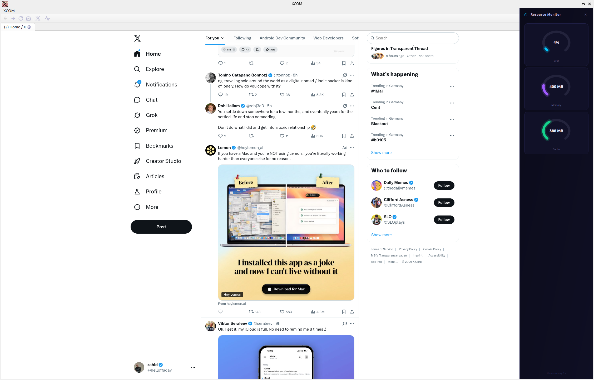
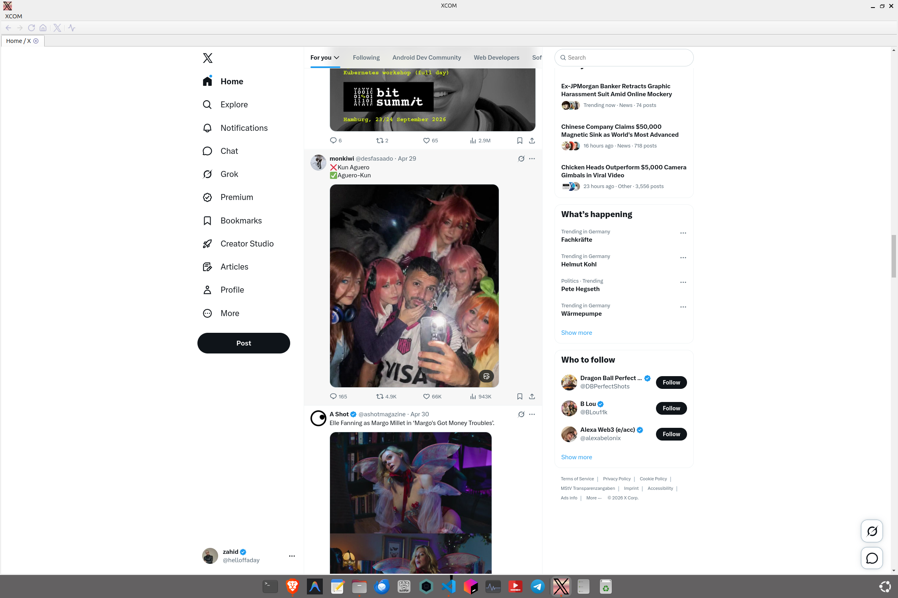

# XCOM - A Lightweight X (Twitter) Desktop Client for Linux

<a href="https://buymeacoffee.com/zahidkh"></a>

XCOM is a performance-focused, dedicated desktop client for X (formerly Twitter) built with C++ and Qt 6. It provides a clean, standalone browsing experience without the overhead of a full web browser.

## Screenshots





## Why XCOM?

* **⚡ Lightweight:** Built on Qt WebEngine (Chromium) but optimized for lower resource consumption compared to standard browsers or Electron apps.
* **📊 Resource Monitor:** A built-in, real-time overlay that tracks CPU usage, System Memory, and WebEngine Cache size.
* **🔒 Privacy Focused:** Your data stays on your machine. XCOM uses standard system paths for session persistence and provides a one-click "Log Out" that clears all cookies and cache.
* **🕵️ Stealth User-Agent:** Automatically masks the `QtWebEngine` signature to ensure full compatibility with X.com features.

## Features

* **Multi-tab support**
* **Integrated Resource Panel** (Toggle via the Activity icon)
* **Persistent Sessions** (Stay logged in between restarts)

## Installation (Debian/Ubuntu)

1. Download the latest `.deb` package from the [Releases](https://github.com/zahid4kh/xcom/releases) page.
2. Install using:

   ```bash
   sudo dpkg -i xcom_1.0_amd64.deb
   sudo apt install -f
   ```

## Building from Source

### Dependencies

* Qt 6 (Core, Widgets, WebEngineWidgets, Concurrent)
* CMake or qmake
* A C++20 compliant compiler (GCC/Clang)

### Build Instructions

```bash
./build.sh
```

## License

This project is licensed under the Apache License 2.0. See [LICENSE](LICENSE) for details.

---
*Disclaimer: This is an unofficial client and is not affiliated with X Corp.*
